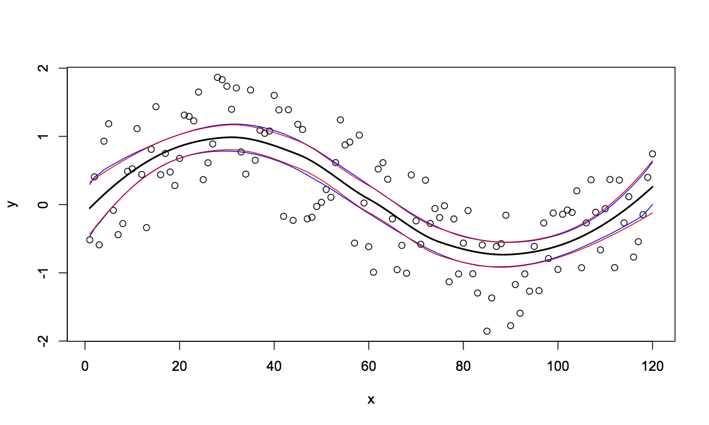

```{r echo=FALSE}
suppressMessages(library(parallel))
suppressMessages(library(doMC))
```

# parallel

## parallel

Part of the base packages in R 

* tools for the forking of R processes (some functions do not work on Windows)

* Core functions:
    
    * `detectCores`

    * `pvec`

    * `mclapply`

    * `mcparallel` & `mccollect`


## detectCores

Surprisingly, detects the number of cores of the current system.

```{r eval=FALSE}
detectCores()

## [1] 24
```

## pvec

Parallelization of a vectorized function call

```{r eval=FALSE}
system.time(pvec(1:1e7, sqrt, mc.cores = 1))

##   user  system elapsed 
##  0.214   0.029   0.243 

system.time(pvec(1:1e7, sqrt, mc.cores = 4))

##   user  system elapsed 
##  0.442   0.185   0.631 

system.time(pvec(1:1e7, sqrt, mc.cores = 8))

##   user  system elapsed 
##  0.532   0.389   0.372 
```


##
```{r eval=FALSE}
cores = c(1,2,4,8,16,24)
order = 6:9
res = sapply(cores, 
             function(x) 
             {
                  sapply(order, 
                         function(y)  
                              system.time(pvec(1:(10^y), sqrt, mc.cores=x))[3] 
                  )
              })
colnames(res) = paste0(cores," cores")
rownames(res) = paste0("10^",order)
res

##      1 cores 2 cores 4 cores 8 cores 16 cores 24 cores
## 10^6   0.017   0.106   0.168   1.102    0.386    0.606
## 10^7   0.158   0.483   0.618   0.589    1.035    0.998
## 10^8   1.419   3.788   3.457   3.162    3.141    3.429
## 10^9  14.530  25.509  34.093  29.933   30.318   29.953
```

## mclapply {.smaller}

Parallelized version of `lapply`

```{r eval=FALSE}
system.time(rnorm(1e6))

##   user  system elapsed 
##  0.101   0.007   0.107 

system.time(unlist(mclapply(1:10, function(x) rnorm(1e5), mc.cores = 2)))

##   user  system elapsed 
##  0.148   0.136   0.106 

system.time(unlist(mclapply(1:10, function(x) rnorm(1e5), mc.cores = 4)))

##   user  system elapsed 
##  0.242   0.061   0.052 ```
```

## {.smaller}

```{r eval=FALSE}
system.time(unlist(mclapply(1:10, function(x) rnorm(1e5), mc.cores = 4)))

##   user  system elapsed 
##  0.097   0.047   0.079 

system.time(unlist(mclapply(1:10, function(x) rnorm(1e5), mc.cores = 8)))

##   user  system elapsed 
##  0.193   0.076   0.040 

system.time(unlist(mclapply(1:10, function(x) rnorm(1e5), mc.cores = 10)))

##   user  system elapsed 
##  0.162   0.083   0.041 

system.time(unlist(mclapply(1:10, function(x) rnorm(1e5), mc.cores = 12)))

##   user  system elapsed 
##  0.098   0.065   0.037 
```

## mcparallel {.smaller}

Asynchronously evaluation of an R expression in a separate process

```{r}
m = mcparallel(rnorm(1e6))
n = mcparallel(rbeta(1e6,1,1))
o = mcparallel(rgamma(1e6,1,1))

str(m)
str(n)
```

## mccollect

Checks `mcparallel` objects for completion

```{r}
str(mccollect(list(m,n,o)))
```

## mccollect - waiting {.smaller}

```{r}
p = mcparallel(mean(rnorm(1e5)))
mccollect(p, wait = FALSE, 10) # will retrieve the result (since it's fast)
mccollect(p, wait = FALSE)     # will signal the job as terminating
mccollect(p, wait = FALSE)     # there is no longer such a job
```

## Exercise 1 - Bootstraping {.smaller}

Bootstrapping is a resampling scheme where the original data is repeatedly reconstructed by taking a sample (with replacement) of the same size of the original data, and using that to conduct whatever analysis procedure is of interest. Below is an example of fitting a local regression (`loess`) to some synthetic data, we will construct a bootstrap prediction interval for this model.


```{r eval=FALSE}
set.seed(3212016)
x = 1:120
y = sin(2*pi*x/120) + runif(length(x),-1,1)
d = data.frame(x=x,y=y)

l = loess(y ~ x, data=d)
pred_y = predict(l,data.frame(x=x))
pred_y_se = predict(l,data.frame(x=x),se=TRUE)$se.fit

plot(x, y)
lines(x, pred_y)
lines(x, pred_y + 1.96 * pred_y_se, col='red')
lines(x, pred_y - 1.96 * pred_y_se, col='red')
```

##

```{r echo=FALSE, fig.align="center", fig.width=9, fig.height=6}
set.seed(3212016)
x = 1:120
y = sin(2*pi*x/120) + runif(length(x),-1,1)
d = data.frame(x=x,y=y)

l = loess(y ~ x, data=d)
pred_y = predict(l,data.frame(x=x))
pred_y_se = predict(l,data.frame(x=x),se=TRUE)$se.fit

plot(x, y)
lines(x, pred_y, lwd=2)
lines(x, pred_y + 1.96 * pred_y_se, col='red')
lines(x, pred_y - 1.96 * pred_y_se, col='red')
```

## Exercise 1 - Cont. {.smaller}

Re-implement the code below using one of the parallelization techniques we have just discussed, check your performance in creating the bootstrap sample using for 1, 2, and 4 cores.


```{r eval=FALSE}
n_rep = 10000
res = sapply(1:n_rep, function(i)
             {
                resample = sample(1:length(x), length(x), replace=TRUE)
                bs = data.frame(
                       x = x[resample],
                       y = y[resample]
                     )
                predict(loess(y ~ x, data=bs), data.frame(x=x))
             })

# Calculate the 95% bootstrap prediction interval
bsi = apply(res,1,quantile,probs=c(0.025,0.975), na.rm=TRUE)

plot(x, y)
lines(x, pred_y, lwd=2)
lines(x, bsi[1,], col="blue")
lines(x, bsi[2,], col="blue")
lines(x, pred_y + 1.96 * pred_y_se, col='red')
lines(x, pred_y - 1.96 * pred_y_se, col='red')
```


## 

<div class="centered">

</div>


# doMC & foreach

## doMC & foreach

Packages by Revolution Analytics that provides the `foreach` function which is a parallelizable `for` loop (and then some).

* Core functions:
    
    * `registerDoMC`

    * `foreach`, `%dopar%`, `%do%`

## registerDoMC {.smaller}

Primarily used to set the number of cores used by `foreach`, by default uses `options("cores")` or half the number of cores found by `detectCores` from the parallel package.

```{r eval=FALSE}
options("cores")

## $cores
## NULL

detectCores()

## [1] 24

getDoParWorkers()

## [1] 1

registerDoMC(4)
getDoParWorkers()

## [1] 4
```

## foreach {.smaller}

A slightly more powerful version of base `for` loops (think `for` with an `lapply` flavor). Combined with `%do%` or `%dopar%` for single or multicore execution.

```{r}
for(i in 1:10) sqrt(i)

foreach(i = 1:5) %do% sqrt(i)   
```

## foreach - iterators {.smaller}

`foreach` can iterate across more than one value

<div class="columns-2">
```{r}
foreach(i = 1:5, j = 1:5) %do% sqrt(i^2+j^2)   
```
```{r}
foreach(i = 1:5, j = 1:2) %do% sqrt(i^2+j^2)   
```
<br/><br/><br/><br/><br/><br/>
</div>


## foreach - combining results {.smaller}

```{r}
foreach(i = 1:5, .combine='c') %do% sqrt(i)   
foreach(i = 1:5, .combine='cbind') %do% sqrt(i)   
foreach(i = 1:5, .combine='+') %do% sqrt(i)   
```


## foreach - parallelization {.smaller}

Swapping out `%do%` for `%dopar%` will use the parallel backend.

```{r}
registerDoMC(4)
system.time(foreach(i = 1:10) %dopar% mean(rnorm(1e6)))
registerDoMC(8)
system.time(foreach(i = 1:10) %dopar% mean(rnorm(1e6)))
registerDoMC(12)
system.time(foreach(i = 1:10) %dopar% mean(rnorm(1e6)))
```

## What to use when?

Optimal use of multiple cores is hard, there isn't one best solution

* Don't underestimate the overhead cost

* More art than science - experimentation is key

* Measure it or it didn't happen

* Be aware of the trade off between developer time and run time


# BLAS and LAPACK

## Statistics and Linear Algebra

An awful lot of statistics is at its core linear algebra.

<br/>

For example:

* Linear regession models, find

$$ \hat{\beta} = (X^T X)^{-1} X^Ty $$

* Principle component analysis

    * Find $T = XW$ where $W$ is a matrix whose columns are the eigenvectors of $X^TX$.
    
    * Often solved via SVD - Let $X = U\Sigma W^T$ then $T = U\Sigma$.


## Numerical Linear Algebra

Not unique to Statistics, these are the type of problems that come up across all areas of numerical computing.

* Numerical linear algebra $\ne$ mathematical linear algebra

<br/>

* Efficiency and stability of numerical algorithms matter

    * Designing and implementing these algorithms is hard

<br/>

* Don't reinvent the wheel - common core linear algebra tools (well defined API)


## BLAS and LAPACK {.smaller}

Low level algorithms for common linear algebra operations

<br/>

BLAS

* **B**asic **L**inear **A**lgebra **S**ubprograms

* Copying, scaling, multiplying vectors and matrices

* Origins go back to 1979, written in Fortran

<br/>

LAPACK

* **L**inear **A**lgebra **Pack**age

* Higher level functionality building on BLAS.

* Linear solvers, eigenvalues, and matrix decompositions

* Origins go back to 1992, mostly Fortran (expanded on LINPACK, EISPACK)


## R + BLAS/LAPACK {.smaller}

```
cr173@gort [~]$ ldd /usr/lib64/R/bin/exec/R 
        linux-vdso.so.1 =>  (0x00007fff922a3000)
        libR.so => /usr/lib64/R/lib/libR.so (0x000000378d400000)
        libRblas.so => /usr/lib64/R/lib/libRblas.so (0x000000378da00000)
        libgomp.so.1 => /usr/lib64/libgomp.so.1 (0x000000378c000000)
        libpthread.so.0 => /lib64/libpthread.so.0 (0x0000003787c00000)
        libc.so.6 => /lib64/libc.so.6 (0x0000003787400000)
        libgfortran.so.3 => /usr/lib64/libgfortran.so.3 (0x000000378cc00000)
        libm.so.6 => /lib64/libm.so.6 (0x0000003787800000)
        libreadline.so.6 => /lib64/libreadline.so.6 (0x000000378f400000)
        librt.so.1 => /lib64/librt.so.1 (0x0000003788800000)
        libdl.so.2 => /lib64/libdl.so.2 (0x0000003788000000)
        libicuuc.so.42 => /usr/lib64/libicuuc.so.42 (0x0000003796a00000)
        libicui18n.so.42 => /usr/lib64/libicui18n.so.42 (0x0000003796600000)
        libgcc_s.so.1 => /lib64/libgcc_s.so.1 (0x0000003789000000)
        /lib64/ld-linux-x86-64.so.2 (0x0000003787000000)
        libtinfo.so.5 => /lib64/libtinfo.so.5 (0x000000378d000000)
        libicudata.so.42 => /usr/lib64/libicudata.so.42 (0x0000003795400000)
        libstdc++.so.6 => /usr/lib64/libstdc++.so.6 (0x0000003789400000)
```


## Modern variants?

Most default BLAS and LAPACK implementations (like R's defaults) are somewhat dated

* Designed for a single cpu core  

* Certain (potentially non-optimal) hard coded defaults (e.g. block size).

<br/>

Multithreaded alternatives:

* ATLAS - Automatically Tuned Linear Algebra Software

* OpenBLAS - fork of GotoBLAS from TACC at UTexas

* Intel MKL - Math Kernel Library, part of Intel's commercial compiler tools

* cuBLAS / Magma - hybrid CPU / GPU library from the ICL at UTK


## Naming conventions

BLAS and LAPACK subroutines are named using form `pmmaaa` where:

* `p` is a one letter code for the type of data

    * `S` single precision floating point
    * `D` double precision floating point
    * `C` complex single precision floating point
    * `Z` complex double precision floating point

* `mm` is a two letter code for the type of matrix expected by the subroutine

* `aaa` is a one to three letter code denoting the algorithm implemented by subroutine


## BLAS Example - DGEMM{.smaller}

`D` - type double, `GE` - general matrix, `MM` - matrix / matrix multiplication.

```
dgemm(   character   TRANSA,
         character   TRANSB,
         integer     M,
         integer     N,
         integer     K,
         double precision    ALPHA,
         double precision, dimension(lda,*)  A,
         integer     LDA,
         double precision, dimension(ldb,*)  B,
         integer     LDB,
         double precision    BETA,
         double precision, dimension(ldc,*)  C,
         integer     LDC 
     )   
```

`DGEMM` performs one of the matrix-matrix operations

$$C = \alpha op( A ) \times op( B ) + \beta C$$

where $op( X )$ is either $op( X ) = X$ or $op( X ) = X^T$, $\alpha$ and $\beta$ are scalars, and $A$, $B$ and $C$ are matrices, with $op( A )$
an $m$ by $k$ matrix, $op( B )$  a $k$ by $n$ matrix and $C$ an $m$ by $n$ matrix.


## LAPACK Example - `DPOTRF` {.smaller}

`D` - type double, `PO` - positive definite matrix, `TRF` - triangular factorization


```
dpotrf(  character   UPLO,
         integer     N,
         double precision, dimension( lda, * )   A,
         integer     LDA,
         integer     INFO 
      )   
```

`DPOTRF` computes the Cholesky factorization of a real symmetric positive definite matrix $A$.

The factorization has the form
$$A = U^T * U,  \text{if UPLO = 'U', or}$$
$$A = L  * L^T,  \text{if UPLO = 'L',}$$
where $U$ is an upper triangular matrix and $L$ is lower triangular.


## OpenBLAS DGEMM Performance

```{r, eval=FALSE}
library(OpenBlasThreads)
x=matrix(runif(5000^2),ncol=5000)

sizes = c(100,500,1000,2000,3000,4000,5000)
cores = c(1,2,4,8)

sapply(cores, 
       function(c) 
       {
            openblas.set.num.threads(c)
            sapply(sizes, 
                   function(s) 
                   {
                        y = x[1:s,1:s]
                        system.time(y %*% y)[3]
                   })
       })
```

##

|  n   | 1 core | 2 cores | 4 cores | 8 cores |
|------|--------|---------|---------|---------|
| 100  |  0.001 | 0.001   | 0.000   | 0.000   |
| 500  |  0.018 | 0.011   | 0.008   | 0.008   |
| 1000 |  0.128 | 0.068   | 0.041   | 0.036   |
| 2000 |  0.930 | 0.491   | 0.276   | 0.162   |
| 3000 |  3.112 | 1.604   | 0.897   | 0.489   |
| 4000 |  7.330 | 3.732   | 1.973   | 1.188   |
| 5000 | 14.223 | 7.341   | 3.856   | 2.310   |

<br/>

Base R BLAS takes ~91 secs for a 5000 x 5000 matrix.

A high-end GPU (K20X) takes 0.24 seconds for a 5184 x 5184 matrix.


